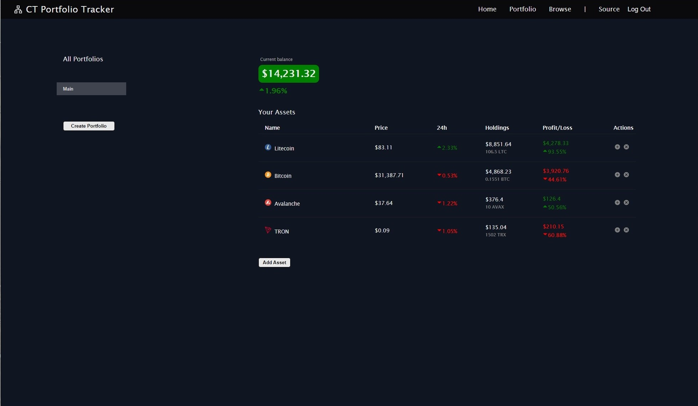
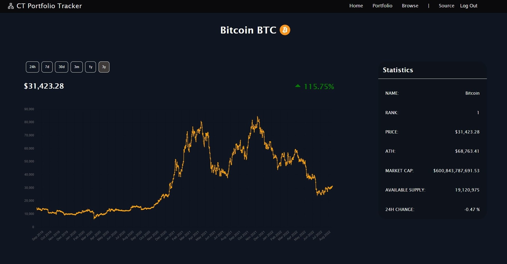

# Crypto-Portfolio-Tracker



## Requirements

- Docker
- Docker Compose

## Usage

Clone the repository

```
git clone https://github.com/DavidREsc/Crypto-Portfolio-Tracker.git
```

Find the example.env file within the directory server/config
Enter your own environment variables for the Coinranking api key and jwt secret

In the root of the project enter the command:

```
docker-compose up --build
```

Open project on http://localhost:3000

